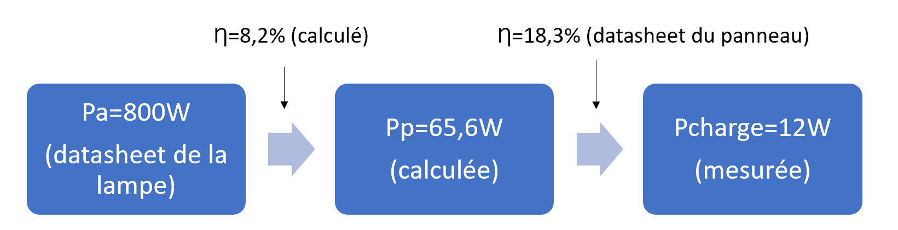

# Afficheur éolienne et Banc de test Photovoltaïque

## Membres de l'équipe

Emre KORKMAZ

Leon PEYRAT

Hugo PIETRI

## I-Introduction

Ce projet a pour but la réalisation d'un dispositif de mesure de la production électrique et de la vitesse de rotation d'une éolienne de particulier, avec afficheur et interface web.

Le projet doit s'adapter aux éoliennes du réseau français Tripalium : https://www.tripalium.org/

Lui-même basé sur le réseau Windempowerment : https://windempowerment.com/

Il y a plusieurs modèles d’éoliennes qui ont des tensions allant de 12 V à 350 V et des puissances pouvant atteindre 2000 W pour la plus grande éolienne (4 m 20 de diamètre). Nous n'adapterons pas notre dispositif pour la version haute tension 350 V ni pour la version 12 V qui délivre directement une tension continue.
Les courants maximums mis en jeux vont de 4 A pour la plus petite éolienne en 48 V à plus de 80 A pour la plus grande en 24 V.

La mesure de vitesse de rotation doit se faire en exploitant le signal triphasé sortant directement de l’éolienne. La mesure de tension et de courant (permettant d’en déduire la fréquence) se fait après le module redresseur de tension, donc en signal continu. 

On doit indiquer les mesures sur des afficheurs dont l’un visuel et didactique (du type rangée de led qui s’allume plus si la puissance produite est plus importante). 

Le système doit être autonome et alimenté directement par l’éolienne (donc nécessité d’une batterie pour l’alimenter en l’absence de vent)

## II-Fonctionnement global de la carte :

### II.1-Partie puissance (alimentation des composants et batterie) :

La carte peut être alimentée de 2 manières : soit par un connecteur micro-USB, soit directement par la tension redressée générée par l’éolienne. Le choix d’alimentation est à effectuer au moyen d’un interrupteur. 
Dans le cas de l’alimentation par l’éolienne, la tension d’entrée est abaissée et régulée à 5 V par un circuit BUCK. Celui-ci accepte en entrée des tensions allant de 6 à 60 V, ce qui lui permet de fonctionner correctement avec les éoliennes 24 et 48 V, et de fournir 5 V même pour des vitesses de rotation de l’éolienne faibles.

Les 5 V en sortie de ce BUCK permettent d’alimenter le circuit de charge de la batterie, le capteur de courant, et l’éventuel vu-mêtre externe.

Comme son nom l’indique, le circuit de charge et protection batterie permet de gérer la charge de la batterie et lui assurer une protection contre les décharges profondes. 

Le régulateur 3,3V a pour objectif de fournir une tension stable pour les composants nécessitant cette tension d’alimentation. C’est le cas de l’ESP32 ou de certains circuits intégrés. 

### II.2-Partie mesures :

La carte est capable de mesurer 3 grandeurs physiques : la tension et le courant en continu, ainsi que la vitesse de rotation de l’éolienne.

La mesure de tension est effectuée par un AOP monté en non inverseur associé à un pont diviseur de tension. La tension est directement prélevée sur le bornier d’alimentation de la carte.

La mesure de courant utilise un capteur à effet Hall dans lequel on fait passer un fil traversé par le courant à mesurer. Il existe plusieurs modèles de ce capteur destinés à mesurer des courants maximums allant de 5 à 50 A. Ce capteur fonctionnant en 5 V et pas en 3,3 V comme l’ESP, on passe par l’intermédiaire d’un circuit d’adaptation de tension.

La mesure de vitesse de rotation est une mesure de fréquence : elle est effectuée sur le signal alternatif en sortie de l’éolienne et entre 2 phases. 
Un bornier présent sur la carte permet de les connecter. Le signal sinusoïdal est d’abord réduit en tension par un pont diviseur, il passe ensuite par un amplificateur d’isolement pour éviter que des surtensions endommagent la carte, puis un AOP monté en bascule de Schmitt non inverseuse permet de le transformer en signal carré plus facilement traitable par l’ESP.

### II.3-Partie affichage :

Les mesures sont affichées sur un site web en local. Pour y accéder, il faut d’abord indiquer dans la zone code prévue à cet effet le nom du réseau WIFI ainsi que le mot de passe pour s’y connecter. 
Une fois le programme téléversé, ouvrez le moniteur série, l’adresse IP de la page web à rentrer dans le navigateur devrait être affichée.

## III-Cahier des charges avec ses fonctions de contraintes 

 
|   | FONCTIONS DE SERVICE     | CRITERES      | NIVEAUX    |  
|---------|---------|--------|-------|
| FP                                                   | Réalisation d'un dispositif de mesure de la production et de la vitesse de rotation d'une éolienne de particulier, avec afficheur et interface web | Précision du système             | 2° de liberté         |  
| FC1                                                  | Conception                        |                                                  |       |  
| FC1-1                                                | Alimentation de la maquette       | Batterie rechargée par la production éolienne    | autonomie d'une semaine sans vent  |  
| FC1-2                                                | Simplicité de fabrication         |              |             |  
| FC1-3                                                | Liaison sans fil                  | Bonne portée                                     | 100m                               |  
| FC1-4                                                | Afficheur de données n°1                                                                                                                           | lisible et précis                                | affichage LCD numérique            |  
| FC1-5                                                | Afficheur de données n°2                                                                                                                           | Ludique, visuel                                  |                                    |  
| FC1-6                                                | Données consultables depuis un smartphone                                                                                                          | facile d'accès et fonctionnelle                  |                                    |  
| FC2                                                  | Mesures                                                                                                                                            |                                                  |                                    |  
| FC2-1                                                | Capteur de courant                                                                                                                                 | Angle de résolution minimal                      | à 0,1A près                        |  
| FC2-2                                                | Mesure de tension                                                                                                                                  | Précis                                           | à 0,1V près                        |  
| FC2-3                                                | Mesure de fréquence                                                                                                                                | Précis                                           | au demi Hertz près                 |  
| FC2-4                                                | Placement des capteurs n'influençant pas le résultat de la mesure                                                                                  |                                                  |                                    |  
| FC2-5                                                | Adaptable sur toute la game d'éoliennes de différentes puissances                                                                                  | Maximiser la précision de mesure dans chaque cas |                                    |  
| FC3                                                  | Coût du dispositif                                                                                                                                 | accessible                                       | moins de 50 €                      |  
| FC5                                                  | Respect du temps imparti pour la réalisation                                                                                                       | contrainte imposée par les enseignants           | Avant mi-janvier                   |  

## IV-Circuit et PCB

Le circuit électrique du dispositif est disponible ici : https://easyeda.com/Hupigotri/compteur_eolienne

## V-Détails pour la réplication du projet

Le circuit et les documents associés sont disponibles en open source et peuvent-être répliqués ou réutilisés sans contraintes.

### V.1-Versions de la carte

#### V.1.a-Version 1.0

Lien du circuit de cette ancienne version : https://easyeda.com/Hupigotri/compteur_eolienne_copy

##### V.1.a.1-Réglage de la carte

Pour téléverser le code, vous aurez besoin d'une carte usb vers uart comme celle à cette adresse : https://fr.aliexpress.com/item/33000531104.html

Lors du téléversement, NE PAS CONNECTER LE VCC sauf si c'est la seule alimentation de l'ESP (ni usb, ni éolienne, ni batterie), il ne faut jamais connecter 2 alimentations ensemble, sinon des composants peuvent griller.

Une fois tous les composants placés sur la carte, il faut régler les 2 potentiomètres. Il est nécessaire de disposer d’un oscilloscope pour cette opération connecté entre la masse et le GPIO 32 de l’ESP. Pour cela, dévissez complètement le potentiomètre n°R33 ce qui a pour effet de mettre sa valeur à son maximum (100 kΩ) et d’annuler la fonction d’hystérésis (seuil basculement haut = seuil basculement bas). 
Ensuite balayez toute la plage de résistance avec le potentiomètre R34 jusqu’à obtenir un signal carré, puis ajustez le pour se rapprocher le plus possible d’un signal de rapport cyclique 0,5. La tension de seuil moyenne a bien été définie.

Ensuite revenez sur le potentiomètre R33 qui permet de fixer les seuils inférieurs et supérieurs de basculement. Cette valeur est un compromis entre des seuils très différents pour éviter des erreurs dus à des parasites ou au bruit, et des seuils proches permettant de mesurer la fréquence même lorsque l’éolienne tourne très lentement et sa tension de sortie est faible. Donc les résultats de mesure de fréquence sont erronés, vissez ce potentiomètre jusqu’à obtenir des valeurs cohérentes, et vissez quelques tours de plus afin de garantir une marge de sécurité.

##### V.1.a.2-Erreurs de conception

-	Le 5 V de sortie du buck n’est pas relié à l’entrée 5 V du capteur de courant, il est nécessaire de souder un fil en externe entre la pin « chargein5v » du contrôleur de charge U1 et le pad 5V de la résistance R25. 
-	Un problème de conversion de tension est présent entre le capteur de courant et l’ESP ce qui limite le courant mesurable à seulement 56 % du courant nominal maximum du capteur de courant (8,5 A dans le cas du capteur 15 A)
-	L’interrupteur de sélection de l’alimentation est inversé : sur la position « éolienne » la carte est alimentée par USB, et inversement.
-	Les potentiomètres sont câblés en inverse, donc lorsque l’on visse la résistance augmente pour l’un et diminue pour l’autre ce qui peut porter à confusion.
-	Pour la sortie vers un éventuel vu-mêtre basé sur des LEDS WS2812, en plus des pin de masse et GPIO19, il y a un VCC (3,3V) alors que ldes leds fonctionnent en 5V.
-	Le dessin PCB du support pour batterie est le mauvais, il est trop petit comparé au support reçu.

#### V.1.b-Version 1.1 

Une nouvelle version de la carte qui corrige les erreurs de conception citées ci-dessus est disponible au lien suivant (même lien que celui indiqué au début du GitHub) : 
https://easyeda.com/Hupigotri/compteur_eolienne

Détail des corrections :

-	Le 5 V de sortie du buck est maintenant bien relié à l’entrée 5 V du capteur de courant, l'étiquette « chargein5v » a été transformée en étiquette d'alimentation et renommée « 5V » pour simplifier la nomenclature.
-	Le problème de conversion est résolu : le transistor a été remplacé par un simple pont diviseur de tension.
-	L’interrupteur de sélection de l’alimentation n'est plus inversé.
-	Les potentiomètres sont bien câblés
-	Pour la sortie vers un éventuel vu-mêtre basé sur des LEDS WS2812, le troisième pin est maintenant une sortie 5V (non actif lors du fonctionnement uniquement sur batterie !).
-       ATTENTION, le support de batterie n'a pas été remplacé, il est toujours trop petit, la modification est à faire ! (non remplacé car il est probablement préférable de remplacer le support par un simple connecteur comme suggéré plus bas dans les pistes d'amélioration)

## VI-Choix et dimensionnement des composants

### VI.1-Composants pour les mesures

#### VI.1.a-L’amplificateur d’isolement AMC1200 (mesure fréquence, composant 1)

L’amplificateur d’isolement AMC1200 supporte au maximum une tension d’entrée crête à crête de 250 mV. 
On effectue un pont diviseur pour obtenir cette tension lorsque la tension max de l’éolienne est présente en entrée (lorsque les batteries sont quasiment chargées), soit 4×14,5V=58 V + 2 V de marge, donc 60 V redressés. Ces 60 V redressés correspondent à 60 ×√2 crête-à-crête, et 60×√2×√3=147 V pour la tension composée (entre 2 phases) crête-à crête. 

On calcule le rapport des résistances du pont diviseur de tension : (tension éolienne composée càc)/(tension entrée AOP)=147/0,250=588
On choisit R9=180 kΩ  et R20=300 Ω  
En plus de leur rapport, on fait attention à 2 points :
- R20 ≪ résistance entrée AMC1200 =28 kΩ 
- R9+R20 pas trop faible pour limiter la dissipation thermique (P_max=0,1 W pour les CMS R0603)

L'AMC1200 est alimenté en 3,3 V, sa sortie oscille autour de 1,27 V avec une amplitude proportionnelle à la tension en entrée. 

#### VI.1.b-AOP TLV225 (mesure fréquence, composant 2)

L’AOP TLV225 est monté en Bascule de Schmitt non inverseuse. 
Les 2 résistances (R21 + R34) et R32 sont un pont diviseur de tension permettant de définir la tension de seuil moyenne. Les 2 autres résistances (R23 + R33) et R22 permettent de fixer les seuils inférieurs et supérieurs de basculement. 
Cette tension est un compromis entre des seuils très différents pour éviter des erreurs dues à des parasites ou au bruit, et des seuils proches permettant de mesurer la fréquence même lorsque l’éolienne tourne très lentement et sa tension de sortie est faible. 

##### V.1.b.1-Compromis parasites :
Si l’on choisit des résistances (R23 + R33) et R22 avec un rapport 40 (1kΩ  et 40kΩ), on a une différence de seuil haut et bas de 0,08 V en sortie de l’AOP alimenté en 3,3V. Soit un rapport de tensions de  60/3.3≈20 , donc 0,08×20=1,6 V de variations sur la tension d’entrée. Si les parasites sont inférieurs à cette valeur, la mesure de fréquence ne sera pas faussée. 

##### VI.1.b.2-Compromis limite minimale de mesure de fréquence :
On reprend les mêmes résistances (R23 + R33) et R22 avec un rapport 40 (1kΩ et 40kΩ), on se rappelle de la différence entre seuil haut et bas de 0,08 V, on peut donc mesurer une sinusoïde qui a cette valeur crête à crête au minimum. Avec une simple règle de 3, on calcule la tension correspondante en entrée de l’AOP : (0,08×0,250)/3,3=6,06 mV 
On utilise le rapport des résistances du pont diviseur de tension calculé plus haut pour déterminer la tension minimale nécessaire à la mesure de fréquence : 6,06∙10^(-3)×588=3,56 V
Grâce aux valeurs des vitesses de démarrage de charge du livre page 86, on peut déterminer la vitesse de rotation des éoliennes pour atteindre cette tension.
Éolienne 24 V et 1m20 : (300×3,56)/24=44,5 tr/min ou 0,74 Hz
Éolienne 48 V et 4m20 : (120×3,56)/48=8,9 tr/min ou 0,15 Hz

#### VI.1.c-AOP TLV225 (mesure tension)

On effectue un simple pont diviseur sur la tension redressée pour avoir une image de la tension en entrée de l’AOP. 
Cet AOP est utilisé pour prévenir du risque de détruire l’ESP : si la sortie du pont était directement reliée sur le CAN de l’ESP, une surtension sur l’entrée ferait monter la tension en entrée du CAN au-dessus de 3,3 V. 
Avec l’AOP entre les 2, ce n’est plus un problème : l’AOP peut supporter des tensions d’entrées supérieures, et étant alimenté en 3,3 V, sa sortie peut saturer mais ne dépassera jamais cette valeur ce qui évite d’endommager l’ESP.

On dimensionne à nouveau le pdt pour une tension max de 60 V : 
On choisit un gain du montage non inverseur de 1+R17/R16=1+10/10=2
Dans ce cas si on veut 3,3 V en sortie au maximum, il nous faut 3,3/2=1,65 V maximum en entrée de l’AOP. 
Le pont diviseur de tension doit donc avoir un rapport min de 60/1,65=36,36 
On choisit 100 kΩ et 2,7 kΩ (rapport de 37,03)

#### VI.1.d-Capteur à effet Hall CSM015SPT5 (mesure courant)

Il existe plusieurs modèles de ce capteur destinés à mesurer des courants maximums allant de 5 à 50 A. 
Ce capteur fonctionnant en 5 V et délivre une tension de 2,5 V pour un courant nul. Ensuite cette tension varie linéairement jusqu'à 4,5 V pour le courant maximum du modèle de capteur choisi, et jusqu'à 0,5 V pour le courant équivalent mais négatif. 
Comme il fonctionne en 5 V et pas en 3,3 V comme l’ESP, on passe par l’intermédiaire d’un circuit d’adaptation de tension. 
On a choisi un circuit classique bidirectionnel composé d'un transistor LBSS138LT1G. 

### VI.2-Composants pour l'alimentation (Buck 5V)

On veut un buck acceptant une tension d'entrée allant jusqu'à 60 V. Pour cela il y a des contrôleurs pour buck particuliers. C'est le cas du LM296HV que nous avons choisi d'utiliser. 

Ce choix a été fait car c'est le composant présent sur la carte suivante et qu'il fonctionnait parfaitement lors des tests :
https://www.aliexpress.com/item/32842453339.html?

Les condensateurs situés en entrée et sortie doivent aussi supporter les tensions maximales à l'entrée et à la sortie respectivement. 
Le choix plus complexe a été celui de l'inductance du circuit

On cherche à la dimensionner afin d'être capable de fournir un courant de 2,5A en sortie.
Pour cela on utilise d’abord la relation d’entrée-sortie : BuckOut = α×Eol_continue  

On connait par ailleurs, grâce à la datasheet, la période de hachage : T =6,67µs et on a fixé l’inductance L2=33µH

On veut Iméd=2,5A on cherche donc à dimensionner IL2MAX sachant qu’on peut calculer l’ondulation de courant dans L2 donné par la relation suivante :
 ∆IL= I_L2MAX  - I_L2MIN  =  ((Eol_continue×T))/L2×α(1-α)  
 
On a l’ondulation maximale pour α=0,5 donc lorsque Eol_continue =10V et BuckOut =5V

On a ∆ILmax=((Eol_continue×T))/(4×L2)=0,5A

On a donc I_L2MAX  = I_méd  +(∆I_Lmax)/2 
AN : I_L2MAX  =2,75A 

On choisit finalement un Inductance I_L2MAX=2,7A

### VI.3-Composants pour la gestion de charge de la batterie

Pour ce bloc fonctionnel on s'est grandement inspiré de deux exemples de circuits de gestion de batterie très similaires :

Celui de GreatScott : https://www.instructables.com/DIY-LiPo-ChargeProtect5V-Boost-Circuit/

Celui d'électronoob : https://electronoobs.com/eng_circuitos_tut49.php

Le seul composant à modifier en fonction de l'utilisation est la résistance placée entre le pin "PROG" du TP4056 et la masse. En effet cette résistance permet de régler le courant de charge de la batterie. On a choisi une résistance de 2 kΩ ce qui définit un courant de charge de 580 mA. Les batteries lithium-ion 18650 que l'on utilise peuvent-être endommagées avec un courant plus élevé. Si l'on souhaite doubler l'autonomie, on peut placer 2 batteries en parallèle, et dans ce cas on peut aussi doubler le courant de charge. Il faut cependant veiller à ce que l'alimentation (le buck 5V et l'alimentation USB) puisse délivrer le courant nécessaire.

La partie Boost 5V présente dans ces deux circuits n'a pas été concervée car les composants nécessitant une alimentation 5V que nous utilisons sont directement reliés à la sortie 5V du Buck sur la carte. Le 5V n'est donc présent que lorsque l'éolienne tourne, mais ce n'est pas un problème puisque seul le  capteur de courant fonctionne en 5V, et le courant est nul lorsque l'éolienne est à l'arrêt. 

### VI.4-Microcontrôleur (ESP32)

Le choix du microcontrôleur s'est porté sur un ESP-WROOM-32U. 
Il est en effet largement utilisé dans l'industrie et facile à programmer. 
Nous l'avons préféré par rapport à un ESP8266 car il est plus rapide, dispose de plus de GPIO, supporte plus d'interruptions et dispose de plus d'entrées analogiques. Il est donc moins restrictif quant à une amélioration future de la carte nécessitant plus de ressources et périphériques.

Dans sa version 32U, il dispose d'un connecteur IPEX permettant de lui attacher une antenne externe. Cela permet d'améliorer la portée WIFI de l'ESP32, notamment en choisissant une antenne à fort gain et en la placant judicieusement.

##   VII-Explications du code

Ce code a été développé sous un environnement arduino. Pour s’assurer son bon fonctionnement, vous devez télécharger les librairies arduino compatibles avec l’Esp32. Le lien suivant vous guidera pour votre installation : https://projetsdiy.fr/installer-esp-idf-esp32-ide-arduino-macos-windows-raspberry/

###   VII.1-Code pour le capteur de tension

Nous avons relié le capteur de tension au pin numéro 34 de notre microcontrôleur. Ainsi, la tension mesurée, qui varie entre 0 et 3,3 V arrive par ce pin. Nous le configurons comme une entrée pour l’esp. L’esp va convertir, via un convertisseur analogique-numérique, cette tension en une valeur allant de 0 à 4096. Les valeurs ici sont binaires et chaque état de tension correspond à un bit. Le 4096 correspond à la valeur maximale de tension fournie par l’éolienne et le 0 à la valeur minimale. Ensuite, nous reconvertissons les valeurs binaires pour arriver à la valeur réelle de la tension fournie par l’éolienne. Afin d’obtenir les valeurs les plus proches de la réalité, nous avons utilisé une fonction affine (y=ax+b). Les coefficients a et b ont été déterminés grâce à un étallonage. Cette fonction permet d’enlever les petites imprécisions du capteur et du CAN.

###   VII.2-Code pour le capteur de courant

Le code du capteur de courant est presque similaire à celui réalisé pour la mesure de tension. Le pin utilisé ici est le pin 35. Il est lui aussi configuré en entrée. On réalise les mêmes conversions que pour la tension. L’esp reçoit une tension entre 0 et 3.3V qu’il convertit en une valeur binaire comprise entre 0 et 4096. Nous retrouvons cette fois-ci le courant fourni par l’éolienne grâce à un polynôme du second degré de la forme a*x²+b*x+c. Un second degré a été choisi car la mesure n'était pas parfaitement linéaire.

###    VII.3-Code pour le capteur de fréquence
Le code pour cette mesure est différent et plus difficile que celui réalisé pour les deux premières mesures. L’initialisation reste, cependant, identique : le pin 32 correspond à l’entrée sur laquelle arrive l’information. Ensuite, nous avons utilisé une interruption pour mesurer la durée d’un créneau de tension car le signal de tension est reçu par l’esp sous la forme d’un signal carré. Pour obtenir la fréquence de l’éolienne, il faut prendre l’inverse de la durée d'une période, soit réaliser l’opération : 1/durée. L’interruption intervient pour mesurer cette durée. En effet, dans notre programme, à chaque fois que la tension va passer de l’état haut (3.3V) à l’état bas (0V), le programme principal va se stopper. L’interruption est prioritaire sur ce dernier. Il reprendra lorsque la tension passera de l’état bas à l’état haut. L’arrêt du programme principal est très court (quelques microsecondes) et nous permet, via une fonction comptant le temps appelée timer, d’obtenir la valeur de la durée. Grâce à l’opération F=1/durée, on obtient la fréquence de l’éolienne. 

## VIII-Atteinte des objectifs

•  Les fonctionnalités
--> Le circuit répond aux exigences primaires exposées dans le cahier des charges : il mesure la tension, le courant et la fréquence, il fonctionne sur batterie, et les grandeurs calculées sont affichées sur une page WEB et sur un écran LCD.

•  Les performances techniques :

L’autonomie : 
--> le circuit consomme 120 mA en fonctionnement normal sous une tension batterie de 3,7 V. La batterie fait 2500 mAh, donc l’autonomie est de 2500/120 = 20,8 heures. C’est moins que la semaine espérée dans le cahier des charges, mais néanmoins largement suffisant pour éviter des redémarrages intempestifs à chaque rafale de vent.

La mesure de tension : 
--> le CAN est de 12 bits donc on a une précision de 60V/2^12 = 0,0146 V. En réalité, sa qualité moyenne amène à des fluctuations qui diminue cette précision à 0,1 V environ. Cette précision est correcte.
	
	
La mesure de courant : 
--> la tension de sortie du capteur varie de 2,5 à 4,5 V, ramené dans la plage 1,65 à 2,97 V, soit un ΔV = 1,32 V. La précision est donc de (1,32×2^12)/3,3=1638 bits. Pour le capteur 15 A, cela correspond à 15/1638 = 9,15 mA. Mais comme pour la mesure de tension, la qualité du CAN amène à des fluctuations qui limitent la précision à environ 100 mA. Ce n’est pas une très bonne précision.

La mesure de fréquence : 
--> D’après nos mesures, la mesure de fréquence et donc de vitesse de rotation est précise à ± 2 %. C’est une valeur correcte.

•  Le coût
--> Une carte revient à 45€ avec ses composants, on est donc bien en dessous des 50 € indiqués dans le cahier des charges.
En revanche, les composants SMD ne sont pas soudés. Si on les fais souder par le fabricant de la carte, il facture un surcoût de 32€, soit 77€ au total.

## IX-Pistes d’amélioration

- Code pour un réglage des potentiomètres sans oscilloscope
- Code pour commander un vu-mêtre connecté à la sortie prévue pour
- Amélioration de l’interface de l’écran avec d’autres menus et d’autres informations
- Ajout d’un circuit permettant de changer la plage de tension de sortie du capteur de courant de 2,5 → 4,5 V à 0 → 5 V
- Remplacer le support de la batterie par un simple connecteur pour réduire la taille de la carte et augmenter les possibilités de choix et agencement de batterie

# Afficheur Photovoltaïque

## Membres de l’équipe 

Mehdi Berrada

Adrien Merel

Youcef Amine Aissaoui

Eliza Filip

Adam Mezaber

## Introduction 

Ce projet à pour but la création d’un banc de test photovoltaïque pour la caractérisation de cartes convertisseurs MPPT (Maximum Power Point Tracking). La première carte est la carte LibreSolar open source. La seconde est une carte industrielle XXXX. Pour ce faire, nous allons réaliser un certain nombre de mesures sur notre banc de test, et notamment des mesures sur la puissance de sorties du convertisseur MPPT. Ces mesures seront réalisées à l’aide de la carte microcontrôleur à base de ESP32 crée pour la projet « Afficheur éolienne ». L’objectif sera, en plus de la caractérisation des cartes MPPT, la visibilité des mesures en temps réel via une interface web. Des pages web seront dont embarquées dans le microcontrôleur ESP32 et devrons être accessible via un PC ou un smartphone. 

La figure suivante explique schématiquement la structuration du banc d’essai :

## Choix de la lampe

Notre PRT consiste à tester et comparer deux MPPT : un Libre Solar en open source ainsi qu’un fait à compléter ici.

Ces derniers permettent de prendre la valeur maximale de puissance en sortie d’un panneau photovoltaïque, et ceux à tout instants. Pour procéder aux tests, nous allons utiliser un panneau salaire 100W que nous allons éclairer avec des lampes fournissant près de 1000W. 

Le but étant de se rapprocher des conditions standards de test, il est très important de bien choisir les lampes d’éclairage pour reproduire au mieux la puissance fixer par les STC (standard test conditions), ainsi que le spectre lumineux du soleil.
Nous allons dons vous présenter ici notre choix de lampe et les raisons de ce choix.

Pour les tests à réaliser, nous avons choisit de prendre deux lampes halogènes de 400W chacune. En effet, nous voulons en sortie du panneau photovoltaïque 100W. Or, nous savons que ce dernier dispositif possède un rendement de près de 10%. Ainsi, deux lampes de 400W (800W au total) va nous permettre de nous rapprocher au maximum des 100W voulus.
Nous avons fait le choix de prendre ce kit de lampe là (et non deux lampes de 500W chacune) car il est livré avec un trépied qui nous permettra d’ajuster facilement la distance source lumineuse – panneau photovoltaïque et d’ajuster l’angle d’impact de la lumière sur le panneau pour tester plusieurs plages de spectre.
Aussi, le prix de ce dispositif (environ 50€) nous parait très correct.
En ce qui concerne le type des lampes, ce sont des lampes halogènes. Nous avons fait le choix de prendre des lampes halogènes pour pouvoir avoir des lampes fournissant près de 400W et qui rentrent dans notre budget. De plus, le spectre d’une lampe halogène présente quasiment la même allure que celui du soleil en après-midi et en fin de journée. Il convient donc pour ces tests.

Ci-dessous, le lien vers le trépied halogène de chez RS :

https://fr.rs-online.com/web/p/projecteurs-de-chantier/7918267/

## Choix du panneau photovoltaïque

Les contraintes que nous avons pour le choix du panneau sont les suivantes :

-	Puissance délivrée d’environ 100W
-	Prix le plus faible possible
-	Fournisseurs : RS
 
Afin de respecter ces trois contraintes nous avons choisi le panneau suivant à 146.2 euros HT :

https://fr.rs-online.com/web/p/panneaux-solaires/1881234/?fbclid=IwAR1PjmZR-h3LvUEhJExDubokRcnUdeqzKAehREmtDqtzwf_Se5cUT-zvQHs

Il s’agit d’un panneau photovoltaïque monocristallin comportant 36 cellules et délivrant une puissance crète d’environ 100W. Ces caractéristiques principales sont résumé dans l’extrait de la datasheet suivant :

Avec ce panneau et nos lampes, nous nous attendons à avoir une puissance délivrée en sortie de 80 à 100W. Cette dernière nous permettrait de caractériser correctement nos convertisseurs MPPT.

## Choix des gradateurs

Il n’est pas nécessaire de rappeler que le but de notre PRT est de tester deux cartes MPPT.
Ainsi, une des conditions de test à prendre en compte est l’éclairage du panneau photovoltaïque. Dans un premier temps, à l’aide du trépied-support des deux lampes, nous pouvons régler l’angle d’incidence de la lumière sur le panneau photovoltaïque et simuler l’angle optimal pour obtenir un maximum de puissance en sortie. Ensuite, nous voulons aussi pouvoir régler la puissance de la luminosité arrivant sur le panneau. Le but étant d’expérimenter les MPPT sous différentes puissances de luminosité et de voir comment ces derniers se comportent. Ainsi, la meilleure façon d’y arriver est d’installer un gradateur en amont de chaque lampe. Cela va nous permettre de régler à notre guise la puissance de luminosité.
Comme expliquer plus tôt, nous avons deux lampes de 400W qui vont éclairer le panneau photovoltaïque. Nous avons choisi d’installer deux gradateurs, un pour chaque lampe, pour des raisons financières. En effet, un gradateur de 800W coûte bien plus cher que deux gradateurs de 400W.

Les deux gradateurs ont été commandé sur RS Component : 

https://fr.rs-online.com/web/p/variateurs-de-lumiere/7903050/

## Calcul section des conducteurs et dimensionnement des protections

Calcul de la section des conducteurs par la méthode du courant Iz fictif :

Formule générale : Iz = In/(K1*K2*K3)

Avec un courant nominal de 10A (Le MPPT ne pouvant supporter plus de 10A on considère cette valeur comme nominal pour être sûr que notre câble pourra supporter le courant circulant)
Détermination de la lettre de sélection et des coefficients à partir des tables.

Lettre de sélection : F

K1 = 1 (D’après le tableau correspondant à K1 le lettre de sélection F correspond à un coefficient 1)

K2 = 1 (Un seul câble)

K3 = 1,06 (D’après la lettre et la température ambiante d’environ 25°C)

Iz = 9,4A 

D’après le tableau de détermination de la section minimale, nous trouvons une section de 1,5mm²

Nous avons chercher à vérifier notre dimensionnement en utilisant un outil de calcul de section de câble.
Calcul Section Câble : 

https://commentcalculer.fr/calcul/section-cable/

Pour ce qui est de la protection, nous allons utiliser un fusible 10A en amont de l'alimentation de la batterie relier au MPPT comme indiqué sur le schéma suivant : 

## Caractérisation du panneau photovoltaïque

Après réception du panneau photovoltaïque, nous avons caractérisé ce dernier. Ainsi, nous avons connecté notre panneau à une charge électronique programmable et nous avons placé notre source lumineuse à 70cm du panneau et nous l'avons orienté de façon à avoir le meilleur éclairage possible. 

Ci-dessous, vous pouvez voir une photo de l'expérience de caractérisation du panneau :

A l'aide de la charge programmable, nous avons pu imposer un courant de sortie du panneau et donc tracé ses caractéristiques V(I) et P(I) qui on une forme très similaira à la litérature. Les courbes sont référencées ci dessous :

Nous remarquons que la puissance maximale du panneau avec ce niveau d'éclairement est bien en dessous de celle attendu dans notre premier dimensionnement. Nous avons donc décidé de réalisé un bilan de puissance de notre installation (Lampes / panneau / charge) pour mieux comprendre ces faibles valeurs.

Nous remarquons deux points d'attention à prendre en compte :

1- Le rendement entre à la puissance électrique en entrée des lampes et la puissance lumineuse qui arrive sur le panneau est particulièrement faible en utilisant des lampes halogène. En effet, ce type de lampe disperse beaucoup d'énergie sous forme de chaleur ce qui réduit leurs efficacité.

2- Le rendement du panneau indiqué sur le bilan de puissance est celui donné par le constructeur pour le spectre de la lumière solaire. Il se voit donc forcement réduit due aux différences de spectre entre la lampe halogène et le soleil ce qui va encore déteriorer le rendement calculé de nos lampes.

Lors de notre premier dimensionnement, nous n'avions pas pris en compte de telles pertes dans les lampes halogène ce qui fausse la puissance de sortie. Pour corriiger ce problème et avoir environ 100W en sortie, il nous faudrait environ 15 lampes 400W ! Ceci n'étant pas une solution valable au vue de notre bujet initiale d'environ 200 euros que nous avions déjà dépassé avec nos différentes commandes. Il nous faudra donc nous contenter d'une faible puissance pour le moment. Un changement de technologie de lampe serait une piste d'amélioration pour ce projet mais le budjet ne sera pas le même.

## Utilisation de la carte MPPT

Afin de pouvoir utiliser le MPPT, il faut au préalable le flasher. En effet, il n'y a pas de code dessus au départ et il est indispensable de téléverser ce dernier dans la carte MPPT.
Suivant la datasheet LibreSolar, le code à flasher a été fait/écrit en C/C++ et est téléchargeble depuis la page GitHub associée au MPPT 1210 HUS.
Ainsi, il suffit de télécharger Visual Studio, un environnement de developpement, et de rajouter l'extension PlatformIO IDE pour pouvoir lire le code. 